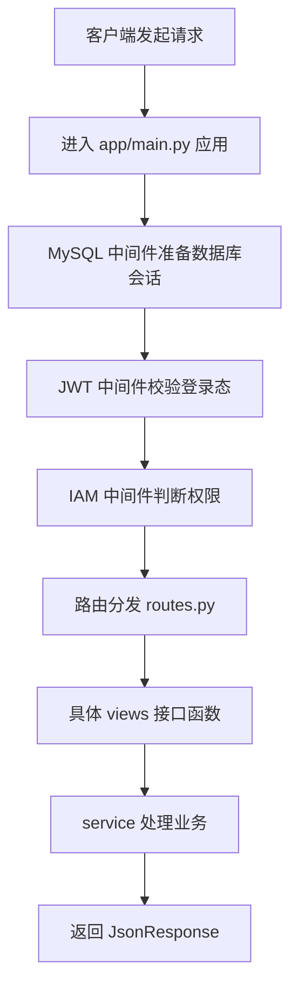

# yy-auth 请求链路初识

## 这篇是干什么的

这一篇专门解决一个问题：

**请求进入 [`yy-auth`](../../../../yy-auth) 以后，大概是怎么走的？**

这件事很重要，因为很多时候看后端项目之所以乱，不是代码真有那么可怕，而是脑子里没有“请求链路图”。

一旦链路有了，很多文件就能对上号：
- 入口在哪
- 路由在哪
- 用户信息在哪挂进去
- 权限在哪判断
- 业务逻辑在哪执行

## 先说一句最通俗的话

你可以把一个请求进入 [`yy-auth`](../../../../yy-auth) 理解成：

**先过门卫，再验身份，再看有没有权限，最后才轮到真正办事的窗口。**

说得更具体一点：
1. 请求先进应用入口
2. 经过中间件
3. 找到对应路由
4. 进入具体接口函数
5. 调 service 处理业务
6. 返回结果

## 先看整体图

这张图先不用抠每个细节，先记住顺序感。

## 第 1 站：应用入口

入口在 [`yy-auth/app/main.py`](../../../../yy-auth/app/main.py)。

在这里做了几件大事：
- 初始化日志
- 拉配置
- 初始化数据库
- 初始化缓存
- 注册中间件
- 注册路由

可以把这里理解成：
**整个服务开机后的总控制台。**

## 第 2 站：中间件

中间件这玩意，一开始容易抽象。

你可以先把它理解成：
**请求在真正进入接口之前，要先走的几道流程。**

### [`mysql.py`](../../../../yy-auth/app/middlewares/mysql.py)
作用：
- 给当前请求准备数据库 session
- 放到 [`request.state.db`](../../../../yy-auth/app/middlewares/mysql.py:10) 里

通俗理解：
**先把“这次办事要用的数据库连接”准备好。**

### [`jwt.py`](../../../../yy-auth/app/middlewares/jwt.py)
作用：
- 看请求有没有带 token
- 校验 token 是否合法
- 根据 token 找到当前用户
- 把用户信息塞进请求上下文

关键位置在：
- [`request.state.user = user`](../../../../yy-auth/app/middlewares/jwt.py:31)

通俗理解：
**先确认你是谁，别匿名瞎闯。**

### [`iam.py`](../../../../yy-auth/app/middlewares/iam.py)
作用：
- 对部分接口做权限判断
- 看当前用户有没有资格调用该接口

关键逻辑在：
- 读请求方法和路径
- 判断是不是需要做权限校验
- 再决定是否放行

通俗理解：
**不是你登录了就啥都能干，还得看你有没有这个权限。**

## 第 3 站：路由分发

当请求通过前面的关卡后，会来到 [`yy-auth/app/routes.py`](../../../../yy-auth/app/routes.py)。

这里负责把不同前缀的请求分发给不同模块。

比如：
- 用户相关
- IAM 权限相关
- 系统管理相关
- 组织管理相关
- 空间管理相关

你可以把它理解成：
**总服务台负责把你引导到正确窗口。**

## 第 4 站：具体接口函数

真正的接口处理函数一般在 views 文件里，比如：
- [`yy-auth/app/apis/user/views.py`](../../../../yy-auth/app/apis/user/views.py)
- [`yy-auth/app/apis/iam/views.py`](../../../../yy-auth/app/apis/iam/views.py)

例如登录接口：
- [`@router.post('/user/login')`](../../../../yy-auth/app/apis/user/views.py:44)

在这里会做的事情通常是：
- 接收参数
- 拿到 request
- 拿到 session
- 调对应的 service
- 返回统一响应

通俗理解：
**窗口工作人员接到你的表单，然后把真正办事的部分交给后面的业务处理。**

## 第 5 站：service 处理业务

视图层通常不会把所有逻辑都写完，而是会调 service。

这一步就是：
- 真正处理业务逻辑
- 查数据库
- 做判断
- 拼返回结果

可以理解成：
**后台真正干活的人在这。**

所以你以后如果看到 views 很短、service 很长，不用奇怪。
这在后端项目里很常见。

### 今天特别值得补的一层理解

在 service 里你会看到两种很典型的资源使用方式：
- [`self.session`](../../../../yy-auth/app/apis/user/service.py:185)
- [`get_redis()`](../../../../yy-auth/app/core/cache.py:36)

这两种写法的差异，当前可以先这样理解：
- [`self.session`](../../../../yy-auth/app/apis/user/service.py:185) 代表数据库会话已经在对象初始化时注入进来了
- [`get_redis()`](../../../../yy-auth/app/core/cache.py:36) 代表 Redis 客户端是通过工具函数按需获取

这不是因为 [`MySQL`](../04-common-infra/mysql.md) 和 [`Redis`](../04-common-infra/redis.md) 在技术本质上谁更特殊，而是因为这个项目对它们采用了不同的封装方式。

如果你以后再看到：
- [`self.session.query(...)`](../../../../yy-auth/app/apis/user/providers/qihoo.py:44)
- [`rds = get_redis()`](../../../../yy-auth/app/apis/user/service.py:145)

就不要只盯着“这一行在干嘛”，还要顺手问自己：
- 这个资源是从哪传进来的
- 它为什么在这里是这种拿法
- 这种拿法背后反映的是项目结构还是技术本身

## 第 6 站：返回响应

最后结果通常会包装成统一响应对象返回，比如：
- [`JsonResponse`](../../../../yy-auth/app/apis/user/views.py:13)

这能保证接口返回结构更一致。

通俗理解：
**事情办完了，给前端一张格式统一的回执单。**

## 用登录这条线粗看一遍

以登录为例，可以先这么理解：

1. 客户端调用登录接口
2. 请求进入应用
3. 走中间件链路
4. 路由命中 [`/user/login`](../../../../yy-auth/app/apis/user/views.py:44)
5. 进入 [`login()`](../../../../yy-auth/app/apis/user/views.py:45)
6. 调 [`UserService`](../../../../yy-auth/app/apis/user/views.py:17) 相关逻辑
7. 校验账号、密码、用户状态
8. 生成 token 或返回登录结果
9. 用统一格式返回给前端

你现在先不用要求自己把 service 全看完。
能先把这条大链认下来，就已经进步很大了。

## 为什么这篇对我重要

因为前端看后端最容易卡在这一步：
- 文件很多
- 不知道从哪进
- 不知道请求怎么走
- 不知道中间件和路由谁先谁后

而一旦链路有了，就会开始有这种感觉：
- 哦，这一层是入口
- 哦，这一层是门卫
- 哦，这一层是分发
- 哦，这一层才是真正办业务

脑子就不会一锅粥。

## 当前一句话总结

**后端请求链路，说白了就是：先进门、验身份、查权限、找窗口、办业务、给回执。**

只要这条主线先记住，后面看 [`yy-auth`](../../../../yy-auth) 代码就会顺很多。
