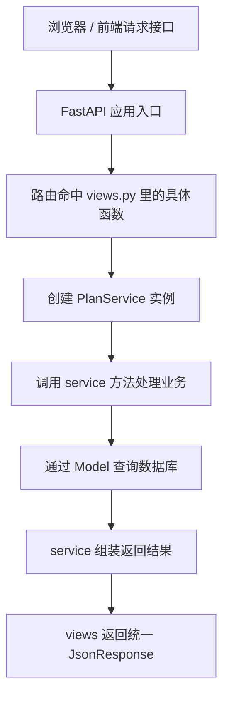

# zhinao-plan 接口链路初识

## 这篇是干什么的

这篇专门记录我第一次把 `zhinao-plan` 跑起来之后，对一个真实接口链路的理解。

重点不是把所有实现细节一次看透，而是先回答这几个问题：

- 一个请求在这个项目里大概怎么走
- `views`、`service`、`model` 分别干什么
- 如果我要自己写一个接口，应该先从哪几层下手

## 先说一句人话

在 `zhinao-plan` 里，一个接口可以先粗略理解成：

**路由先接请求，service 真正处理业务，model 负责把 Python 对象和数据库表对应起来。**

## 这次看的真实接口

这次跟的是一个 GET 接口：

```text
/api/plan-pro/aiexpert/list_all_expert?support_env=wx
```

对应到项目代码里的入口，大致落在：

- `app/apis/plan/views.py`
- `app/apis/plan/services.py`
- `app/apis/plan/models.py`

## 先看整体链路图



## 第 1 站：路由层在干什么

路由层通常在 `views.py`。

这一层最主要做这些事：

- 定义这是 GET 还是 POST
- 定义接口路径
- 接收 query 参数、body 参数、request、数据库 session
- 调用对应的 service
- 返回统一响应

它更像：

**窗口前台，负责接单和回单。**

这一层通常不适合堆很多业务逻辑。

## 第 2 站：service 在干什么

service 可以先理解成：

**真正处理业务的地方。**

这一层通常负责：

- 查数据库
- 写数据库
- 做业务判断
- 调其他能力
- 组装返回结果

所以你看到路由函数比较短，而 service 方法比较长，是很正常的。

### service 是不是固定规则

不是语言强制规则，但在真实后端项目里很常见。

它是一种工程分层习惯，不是 Python 语法硬要求。

也就是说：

- 可以不用 service
- 但项目一大，不分层通常会越来越难维护

### 为什么经常要实例化 service

因为 service 往往需要带着一些上下文工作，比如：

- 数据库 session
- 请求头信息
- 当前用户信息
- 当前 provider / category 之类业务上下文

所以很多项目会写成：

```python
service = PlanService(session, request.headers, provider, category)
```

这不是 Python 规定的固定写法，而是这个项目对 `PlanService` 的设计方式。

如果以后你自己写别的 service，也可以只传一个 `session`，或者传更多参数。

关键不在“固定格式”，而在：

**这个 service 工作时需要哪些上下文。**

## 第 3 站：model 在干什么

model 可以先理解成：

**数据库表的代码映射说明书。**

比如一个模型类里通常会写：

- 表名叫什么
- 每一列叫什么
- 每一列是什么类型
- 能不能为空
- 默认值是什么

你可以把它类比成前端里的类型定义，但它比普通类型定义更进一步：

**它不只是描述数据结构，还和数据库表建立了映射关系。**

### model 怎么知道自己对应哪张表

通常就是靠：

```python
__tablename__ = "ai_experts"
```

### model 怎么知道有哪些字段

通常就是靠一行行字段声明，比如：

```python
name = Column(String(100), nullable=False)
status = Column(SmallInteger, default=1)
```

这些定义告诉 ORM：

- 这个表里有哪些列
- 列的类型是什么
- 基本约束是什么

### 如果表字段变了，model 会自动同步吗

通常不会自动同步。

日常开发里更常见的是：

- 先改 model
- 再通过迁移工具同步数据库
- 或者手动在数据库工具里改表

如果你只是本地调试，手动在 DBeaver 里改表是可以的。

只要保证：

**代码里的 model 定义和数据库里的真实表结构一致**

程序就能正常工作。

## 如果我要自己写一个接口，可以先按什么套路来

可以先用最朴素的三步走：

### 第一步：先想清楚这个接口做什么

比如：

- 查详情
- 查列表
- 新增一条记录
- 更新某个字段
- 删除一条数据

### 第二步：先写路由层

在 `views.py` 里先定义：

- 路径
- 请求方法
- 参数
- 调哪个 service

### 第三步：再写 service 层

在 service 里处理：

- 参数校验
- 数据库查询
- 业务判断
- 返回结构

### 第四步：如果要落库，再看 model 是否需要补字段

如果当前表结构已经足够，就直接用。

如果不够，再决定：

- 改 model
- 改数据库表结构

## 这次还顺带学到的一个点：为什么要先把项目跑起来

因为在项目没跑起来之前，你对这些层的理解很容易停留在“纸上理解”。

但项目真正起来后，你可以：

- 看 Swagger 文档页
- 实际调接口
- 对照代码找实现
- 一层层跟进去

这时你对：

- 路由
- service
- model
- 配置
- 启动方式

都会更有实感。

## 一句话总结

对于 `zhinao-plan` 这种项目，现阶段先记住这条主线就够了：

**接口来了先到 views，真正干活在 service，数据库映射在 model；如果要自己写接口，就也按这三层往下落。**

## 待整理碎片

> 这一区放的是还没提炼成正文的会话草稿。来源和流程见 [`知识库使用方法`](../../00-index/index.md)。
> 攒够了或想清楚了，就把对应碎片提炼进上面的正文章节，然后从这里删掉。
> 当前为空，等后续会话产出草稿后往这里放。
