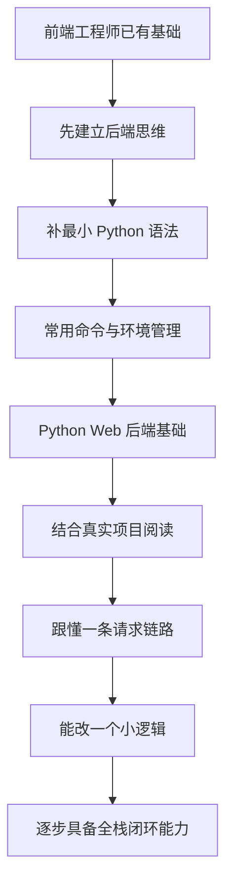

# Python 学习地图

## 这张地图是干什么的

这不是考试大纲，也不是死板课表。

它更像一张路线图，帮我在学习 Python 和后端的过程中别走丢。

主要解决 3 个问题：
- 我现在在哪
- 我接下来该学什么
- 我是不是又开始东看一点、西看一点，最后没形成体系

## 当前主线目标

当前目标不是单纯“学会 Python 语法”，而是：

**从前端工程师逐步长出 Python、后端、再到全栈的理解和落地能力。**

说白一点：
- 不只是看得懂一些代码
- 而是以后慢慢能接住 Python 项目
- 最后能做一点前后端闭环的事情

## 当前最适合我的方式

### 不是硬啃语法大全
如果上来就一头扎进语法，很容易学成这样：
- 语法好像看过
- 类也知道一点
- 装饰器听说过
- 真给一个项目，还是一脸懵

所以我现在更适合：
- 学一点基础
- 立刻放进真实项目里认
- 再回头补抽象概念

### 真实项目是最好的教材
当前最适合我的切入口：
- [`yy-auth`](../../yy-auth)
- [`zhinao-clue-standard`](../../zhinao-clue-standard)

但第一站先从 [`yy-auth`](../../yy-auth) 开始。

因为它已经能帮我认识很多 Python Web 后端里的真实东西：
- 接口框架
- 启动方式
- 参数校验
- 数据库
- 缓存
- 配置中心
- JWT
- 权限系统

## 学习路线

## 分阶段理解

### 第一阶段：先建立后端视角
目标：先把观察系统的角度从“页面和交互”切到“数据、规则、权限、链路”。

这一步非常关键。

因为前端转后端最容易卡住的，不一定是语法，而是脑子里还在用前端默认视角看问题。

当前建议先建立这些认知：
- 后端不是只写接口，而是在管理数据和规则
- 请求不是直接进业务，而是会经过入口、中间件、路由、业务层
- 权限不只是按钮显隐，更是系统级边界控制
- 数据不只是拿来展示，还要考虑落库、缓存、状态流转

这一步建议优先阅读：
- [`01-basics/backend-thinking.md`](./01-basics/backend-thinking.md)

### 第二阶段：先补最小语法集合
目标：不是学完 Python，而是先补够项目阅读用的基础语法。

当前更适合先掌握：
- 变量
- 列表和字典
- [`if`](./01-basics/python-syntax-for-frontend.md)
- [`for`](./01-basics/python-syntax-for-frontend.md)
- 函数
- 类和对象
- [`self`](./01-basics/common-commands.md)
- import
- 异常处理
- 类型标注

这一步建议优先阅读：
- [`01-basics/python-syntax-for-frontend.md`](./01-basics/python-syntax-for-frontend.md)

### 第三阶段：先建立文件角色感
目标：先知道 Python 项目里常见文件分别负责什么，并和前端工程经验建立映射。

相比从零学编程，我更适合先把“文件在项目里扮演什么角色”认出来。

可以先用这两个项目里真实能看到的文件来建立感觉：

- `app/main.py` ≈ 前端项目里的应用启动入口，比如 `src/main.ts`
  - 负责启动应用
  - 注册全局能力
  - 挂中间件、挂路由

- `app/routes.py` ≈ 前端项目里的路由配置，比如 `src/router.ts`
  - 前端是 URL 对应页面
  - 后端是 URL 对应接口处理函数

- `middlewares` 目录 ≈ 路由守卫 + axios 拦截器
  - 在请求真正进入接口前做统一处理

- `requirements.txt` ≈ 前端项目里的依赖清单，比如 `package.json`

- `Dockerfile` ≈ 服务部署镜像说明书

- 具体接口文件 ≈ 页面事件入口 / 接口入口层
  - 在 [`yy-auth/app/routes.py`](../../yy-auth/app/routes.py:9) 里能看到项目通过 [`importlib.import_module()`](../../yy-auth/app/routes.py:9) 去加载 `apis.user.views`、`apis.iam.views` 这类模块
  - 这说明这个项目里“接口入口层”主要分布在各业务模块下的 `views.py` 中

- 业务逻辑层
  - 不一定都会直接叫 `service.py`
  - 真实项目里有时会叫 service、manager、crud、handler，或者直接写在模块内部
  - 所以这里先认“职责”比先认“文件名”更重要

- 数据实体 / 数据访问层
  - 也不一定统一叫 `models.py`
  - 有的项目会拆成 schemas、models、entity、dao 等不同名字
  - 先知道“谁在描述数据、谁在操作数据库”就够了

这一阶段先不要急着抠细节，只要先知道：
- 这个文件大概干什么
- 它在项目里属于哪一层
- 它和前端哪个位置最像

### 第四阶段：再建立地图感
目标：先知道大概，不追求一开始就全懂。

当前应该先能回答：
- 这是个什么服务
- 它用了什么技术
- 请求从哪进
- 用户信息在哪拿
- 权限在哪校验
- 配置从哪来

只要这几件事开始有轮廓，就已经不是瞎看了。

### 第五阶段：先认高频词
目标：看到常见词不慌。

比如：
- [`FastAPI`](../../yy-auth/requirements.txt)
- [`uvicorn`](../../yy-auth/requirements.txt)
- [`gunicorn`](../../yy-auth/requirements.txt)
- [`pydantic`](../../yy-auth/requirements.txt)
- [`SQLAlchemy`](../../yy-auth/requirements.txt)
- [`Redis`](../../yy-auth/requirements.txt)
- [`Nacos`](../../yy-auth/app/core/zn_nacos.py)

这里先追求：
- 会大概读
- 知道它大概干嘛
- 知道它为什么会出现在项目里

### 第六阶段：看懂一条主链路
目标：不是看懂所有代码，而是先跟懂一条主链。

当前推荐的第一条主线：
- 登录
- token
- 当前用户
- 权限树

为什么先看这个？
因为这条线最容易和前端已有经验挂上钩。

### 第七阶段：开始轻实战
目标：能动一点，而不是一直只看。

比如：
- 改一个小逻辑
- 理解一个接口参数
- 找到一个报错位置
- 补一段项目阅读笔记

## 我当前的原则

1. 不求一步到位
2. 不追求装懂
3. 先把阶段顺序走对，再逐步加深
4. 不把项目阅读搞成受苦
5. 尽量边学边沉淀成自己的话

说得糙一点：
**别把学习搞成“今天猛灌，明天全忘”。**

知识库的意义，就是把这些东西慢慢变成：
- 我自己的语言
- 我自己的理解
- 我以后回头还能接着学的基础

## 后续主题预留

未来知识库不会只有 Python。
还会继续长出：
- 前端开发
- RC 遥控车
- 路亚
- 其他长期兴趣或技能主题

所以这里的写法也会尽量保持统一：
- 有总览
- 有术语
- 有基础
- 有实战
- 有临时笔记
- 有后续可迁移到博客的可能
