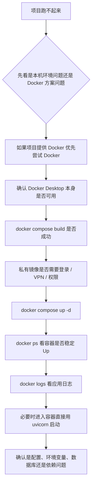

# Docker 排障记录：以 zhinao-plan 为例

## 这篇是干什么的

这篇专门记录一次真实的 Docker + Python 项目排障过程。

目标不是记流水账，而是沉淀成以后还能复用的判断框架。

## 场景

接手一个 Python 后端项目 `zhinao-plan`，目标是：

- 先把项目跑起来
- 再理解接口链路
- 再为后续自己写接口做准备

在这个过程中，先后遇到了：

- 本机 Python 依赖安装失败
- Docker Desktop 无法启动
- 私有镜像仓库鉴权失败
- 容器反复重启
- 应用配置缺失导致启动失败
- 最终通过环境变量修正成功启动

## 第一阶段：本机 Python 依赖安装失败

一开始直接安装 `requirements.txt`，遇到依赖和 Python 版本兼容问题。

这个阶段最重要的判断不是“继续硬修这个包”，而是：

**先看项目有没有官方更推荐的运行方式。**

如果项目本身已经给了：

- `Dockerfile`
- `docker-compose.yml`

那就说明项目更可能希望你走容器方案。

## 第二阶段：Docker Desktop 本身启动失败

刚开始连 Docker Desktop 都起不来。

表面现象是：

- 双击应用闪一下就退出
- 没有菜单栏图标
- `docker --version` 不可用

这个阶段的核心经验是：

### 先别急着怀疑项目

因为这时问题还停留在工具层，不是业务项目层。

### 先看系统级线索

比如：

- 芯片架构是否匹配
- 应用是否真的安装到 Applications
- 系统日志里有没有签名、证书、信任链相关错误

最后重新安装 Docker Desktop 后恢复正常。

## 第三阶段：私有镜像仓库拉取失败

能执行 `docker compose build` 之后，又遇到了私有镜像鉴权失败。

比如典型现象：

- 基础镜像来自公司 Harbor
- 返回 `401 Unauthorized`

这个阶段最重要的判断是：

**不是 Docker 坏了，而是你没有权限拉取私有镜像。**

这类问题常见解决方向：

- `docker login` 私有仓库
- 连接公司 VPN
- 让同事开通镜像仓库权限

## 第四阶段：容器能启动，但服务不可用

后面出现过一种很典型的情况：

- `docker compose up -d` 看起来成功了
- 但浏览器访问 `localhost:8829/docs` 失败
- `docker ps` 里服务容器不断重启

这个阶段最重要的认知是：

**容器启动成功，不等于应用启动成功。**

所以要接着看：

```bash
docker ps
docker logs 容器名
```

## 第五阶段：Gunicorn 日志把真正错误淹没

当时日志里先看到很多 Gunicorn 和日志系统本身的报错，导致很难直接定位根因。

这个阶段很值得记住的经验是：

### 如果服务框架日志太乱，可以绕过它

不要死盯着复杂日志系统。

可以进入容器，直接手动执行更简单的启动命令，比如：

```bash
uvicorn app.main:app --host 0.0.0.0 --port 6969
```

这样常常能把真正的启动错误直接打出来。

## 第六阶段：真正根因是环境变量和配置文件

最终拿到的关键错误是：

```text
AttributeError: 'Settings' object has no attribute 'NACOS'
```

这个错误后来定位到：

- 项目通过环境变量 `ZN_ENV` 决定加载哪个配置文件
- Compose 里虽然写了 `ZN_ENV=$ZN_ENV`
- 但宿主机并没有设置这个环境变量
- 所以传进容器的是空字符串
- 应用没有正确加载到目标配置
- 最终启动失败

### 这个阶段的经验非常重要

看到这类配置写法时：

```yaml
environment:
  - ZN_ENV=$ZN_ENV
```

要立刻想到：

**宿主机如果没这个变量，容器里也不会凭空有。**

## 第七阶段：正确启动方式

最后通过带环境变量启动，容器稳定运行：

```bash
ZN_ENV=dev docker compose up -d
```

之后再看：

```bash
docker ps
```

当服务容器状态能持续保持 `Up`，而不是每隔几秒重启，就说明主问题已经解决了。

然后再访问：

```text
http://localhost:8829/docs
```

成功打开 FastAPI 文档页，说明整个链路终于通了。

## 从这次排障里沉淀出来的排查顺序



## 这次最值得长期记住的几件事

### 1. 容器活着，才谈得上接口可访问

先别急着看浏览器。

先看：

```bash
docker ps
```

### 2. `Started` 不代表服务真正常

Docker 说容器启动了，只代表它尝试把进程拉起来了。

服务是否真正稳定，还得看容器状态和日志。

### 3. 配置问题在后端项目里非常常见

后端项目经常不是死在业务逻辑，而是死在：

- 环境变量
- 配置文件
- 数据库连接
- 外部服务配置

### 4. 看不懂复杂日志时，优先简化启动路径

绕开 Gunicorn、多进程、复杂日志链路，直接用单进程命令跑，是非常实用的排障手法。

### 5. 前端接后端项目时，先求跑起来，再求完全理解

这不是偷懒，而是更高效。

项目真正跑起来后，你对：

- 端口
- 配置
- 路由
- 文档页
- 请求链路

都会更有实感。

## 一句话总结

这次 `zhinao-plan` 的经验可以浓缩成一句话：

**前端接手 Python 后端项目时，Docker 不只是运行工具，也是排查环境、配置、权限和启动链路问题的入口。**
