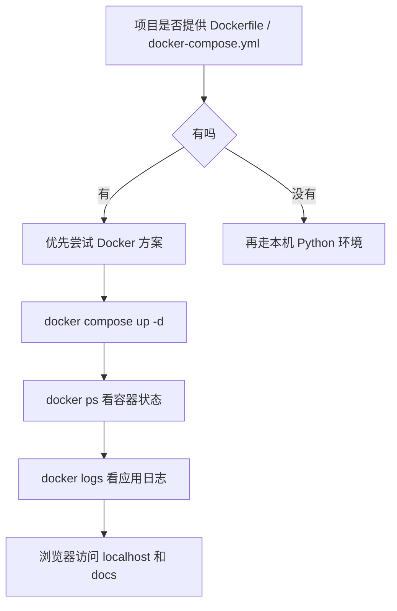

# Docker 与 Python 项目

## 这篇是干什么的

这篇专门解决一个很实际的问题：

**为什么前端接手 Python 后端项目时，Docker 往往比直接折腾本机环境更稳？**

## 先说一句人话

很多 Python 项目跑不起来，不一定是代码坏了，而是：

- 解释器版本不对
- 包版本不对
- 系统库不对
- 本机环境和项目预期环境不一致

这时候 Docker 的价值就出来了。

你可以把它理解成：

**项目作者已经帮你准备了一台更接近标准答案的小机器。**

你不一定非要在自己电脑本机把所有运行条件重新手搓一遍。

## 为什么 Python 项目更容易卡环境

前端项目常见问题通常是：

- `node` 版本
- 包管理器版本
- 锁文件差异

Python 项目除了这些类似层面，还常常会多出：

- Python 主版本差异
- 某些依赖需要本地编译
- 某些包依赖系统动态库
- 配置文件和环境变量比较重

比如你在真实项目里可能会遇到：

- 包和 Python 3.14 不兼容
- 本地安装失败，但镜像里的 Python 3.12 可以跑
- 容器能拉起，但应用因为配置缺失启动失败

## 一个典型思路

接手 Python 后端项目时，可以先这样判断：

### 情况 1：项目已经提供 Docker 方案

比如有这些文件：

- `Dockerfile`
- `docker-compose.yml`

这通常说明：

**项目作者本来就希望你尽量按容器方式运行。**

对于不熟 Python 的人，这往往是更省心的起点。

### 情况 2：项目没有 Docker，只能走本机环境

那就得自己处理：

- Python 版本
- 虚拟环境
- `requirements.txt`
- 系统依赖
- 配置文件

这条路不是不能走，但对新手来说更容易卡。

## 你可以怎么理解 `Dockerfile`

`Dockerfile` 可以先理解成：

**项目运行环境的制作说明书。**

它会描述类似这些步骤：

1. 以哪个基础镜像为底
2. 把哪个依赖文件复制进去
3. 执行什么安装命令
4. 把项目代码复制进去
5. 最后启动什么程序

所以当你执行：

```bash
docker compose build
```

本质上是在按 `Dockerfile` 这份说明书制作项目镜像。

## 你可以怎么理解 `docker-compose.yml`

`docker-compose.yml` 可以先理解成：

**项目运行清单。**

它主要描述：

- 服务叫什么
- 用哪个镜像或怎么构建镜像
- 端口怎么映射
- 目录怎么挂载
- 环境变量怎么传
- 启动命令是什么

所以当你执行：

```bash
docker compose up -d
```

本质上是在按这份清单把项目跑起来。

## 为什么浏览器能访问 `localhost:8829`

因为 Compose 里通常会写端口映射，比如：

```yaml
ports:
  - 8829:6969
```

这意味着：

- 容器内部服务监听 `6969`
- 宿主机通过 `8829` 访问它

所以你在浏览器里打开：

```text
http://localhost:8829/docs
```

本质是在访问容器里的 FastAPI 文档页。

## 为什么容器能起来，不代表项目就真的可用

这是一个非常重要的认知。

`docker compose up -d` 成功，只能说明：

- Docker 成功创建并尝试启动了容器

但不代表：

- 容器里的应用启动成功
- 数据库连接成功
- 配置读取成功
- 接口服务真的在监听端口

所以后面常常还要检查：

```bash
docker ps
docker logs 容器名
```

## 一个很常见的真实问题：配置和环境变量

有些项目启动时不是先报业务错，而是先报配置错。

比如：

- 环境变量没传进去
- 应用按环境变量决定加载哪个配置文件
- 没加载到配置文件，服务就直接启动失败

所以看到这种配置：

```yaml
environment:
  - ZN_ENV=$ZN_ENV
```

要意识到：

**如果宿主机没有设置 `ZN_ENV`，容器里拿到的很可能就是空值。**

这会进一步导致项目启动失败。

## 对前端同学最实用的判断标准

如果你只是想先把项目跑起来，可以先按这个顺序判断：



## 一句话总结

对前端接手 Python 后端项目来说，Docker 最实际的价值通常不是“学会容器原理”，而是：

**先用更接近项目标准环境的方式把服务跑起来，再一边运行一边理解它。**
